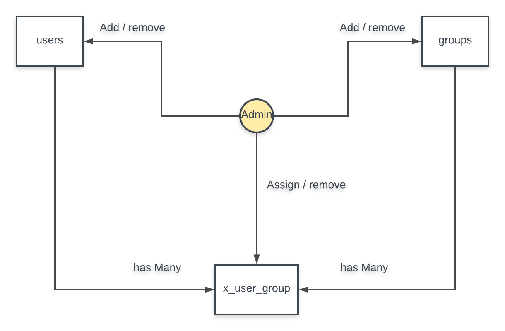

### installation guide :- 

```sudo docker-compose build```

```sudo docker-compose up -d```

```sudo docker-compose exec php bash```

```composer update```

```exit```


##### add this url to your machine hosts 

```users.dev```


##### create working database 

```CREATE SCHEMA `users` DEFAULT CHARACTER SET utf8 ;```


##### create testinging database 

```CREATE SCHEMA `users_test` DEFAULT CHARACTER SET utf8 ;```


##### run migration 

```sudo docker-compose exec php bash```

```php yii migrate```

```exit```


##### running the api test

```codecept run api```


##### running the unit test

```codecept run unit```


